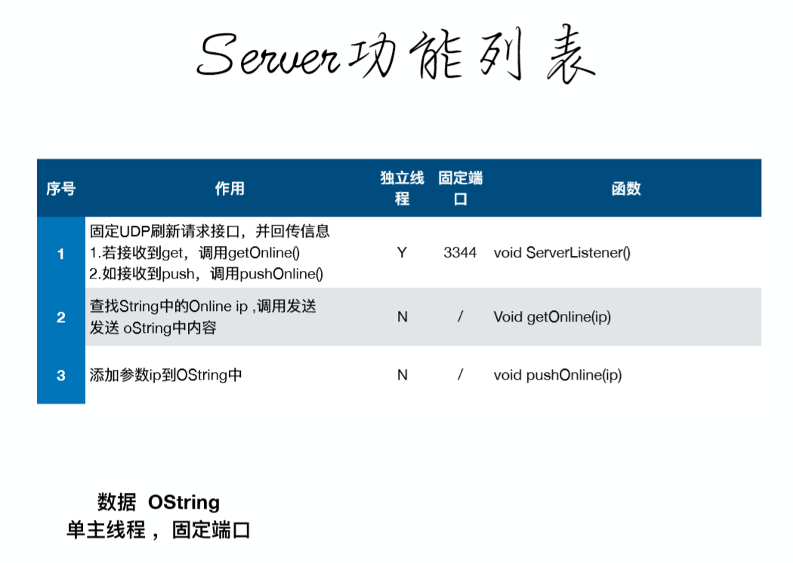

# QQImitate

"<i>If you have a goal, then you will find a way to achieve it.</i>"

<h4 align="center">Tencent QQ client Simple Imitate</h4>

 

  
  
  

  Created by
  <a href="http://grj321.com">gaoljhy</a> and
  <a href="https://github.com/gaoljhy/QQImitate/contributors">
    contributors
  </a>

 

****

## 简单实现

### 结构简单设计

PDF : [QQActive.pdf](./QQActive.pdf)

### Frame

### 界面视图

## 代码

### Server端

> 使用 `.netCore` 实现

### Client 端

------------

## 钓鱼使用主界面

> 很暴力,不适合小朋友

具体指导操作不做表述

> 设定好SMTP邮箱配置信息发送即可哦
